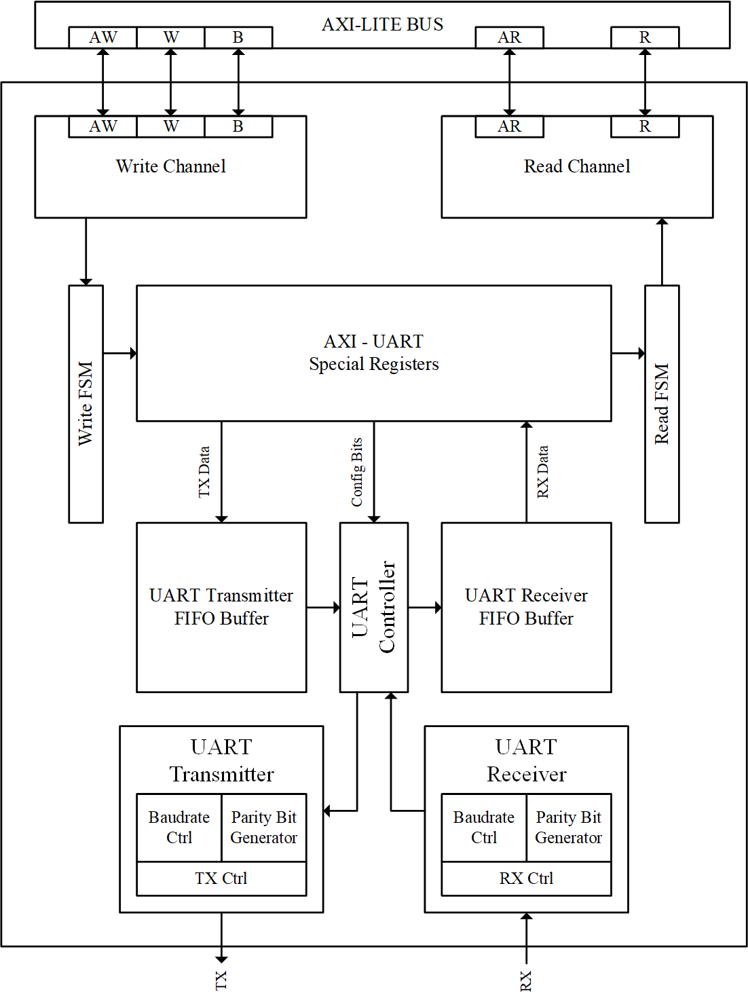

# RISC-V VeeR EL2 Based Real-Time Data Buffering SoC

[](https://github.com/ganesh05-p/Honours_lab_ganesh_317)
[](soc_project_data%20buffering/rtl)
[](soc_project_data%20buffering/rtl/axi_interconnect_wrap_2x8.v)
[](soc_project_data%20buffering/run)
[](#8-known-limitations)

An AXI4 interconnect-centric SoC (honours lab project) that will connect a **VeeR EL2 RISC-V CPU** and DMA-style masters to an **I2C master**, an **AES-128 core** and a **UART**.

**Author:** [@ganesh05-p](https://github.com/ganesh05-p) · **Repo:** [Honours_lab_ganesh_317](https://github.com/ganesh05-p/Honours_lab_ganesh_317)

---

## Table of Contents
1. [Project status at a glance](#1-project-status-at-a-glance)
2. [Architecture](#2-architecture)
3. [Repository layout and where to find things](#3-repository-layout-and-where-to-find-things)
4. [IP cores: sources and paths](#4-ip-cores-sources-and-paths)
5. [How to run the simulations](#5-how-to-run-the-simulations)
6. [Verification](#6-verification)
7. [Wrapper generator](#7-wrapper-generator)
8. [Known limitations](#8-known-limitations)
9. [Roadmap](#9-roadmap)
10. [Licenses and provenance](#10-licenses-and-provenance)
11. [Documentation index](#11-documentation-index)

---

## 1) Project status at a glance

| Stage | Block | Status |
|---|---|---|
| 1 | AXI4 crossbar (decode, arbitration, routing) | ✅ Built and self-checking-tested against dummy slaves |
| 2 | I2C master on the crossbar (needs AXI-to-WISHBONE bridge) | ⛔ Not started (IP vendored) |
| 3 | AES-128 on the crossbar (AXI register wrapper) | 🟡 Wrapper exists and works, but tested only with a *different*, standalone interconnect |
| 4 | UART on the crossbar (needs AXI4-full wrapper for AXI4-Lite core) | ⛔ Not started (IP vendored) |
| 5 | VeeR EL2 CPU as master `s00` | ⛔ Not started (PRM checked in, no core source) |
| 6 | VCS/Verdi simulation flows | 🟡 Ready for the interconnect and each standalone IP, not yet for the integrated SoC |

> **In short:** the interconnect is proven, the peripherals are vendored but not yet wired into it, and there is no SoC top or CPU yet.

---

## 2) Architecture

### 2.1 Current implementation (what exists today)

Only the crossbar and dummy slaves exist. Every `mXX` port is driven by the same generic dummy slave; the names show where real blocks will be placed.

<p align="center">
  
</p>

### 2.2 Target architecture (end goal)

Colours show integration status: green is built and tested, yellow is partial, dashed grey is not started or planned.

<p align="center">
  
</p>

### 2.3 Placeholder address map

Each window is 2^24 = 16 MB. Used by the interconnect testbench.

| Port | Base address | Planned function | Currently backed by |
|---|---|---|---|
| m00 | `0x0000_0000` | Instruction memory | dummy AXI slave |
| m01 | `0x1000_0000` | Data memory | dummy AXI slave |
| m02 | `0x2000_0000` | FIFO | dummy AXI slave |
| m03 | `0x3000_0000` | DMA controller | dummy AXI slave |
| m04 | `0x4000_0000` | Interrupt controller | dummy AXI slave |
| m05 | `0x5000_0000` | UART | dummy AXI slave |
| m06 | `0x6000_0000` | Timer | dummy AXI slave |
| m07 | `0x7000_0000` | GPIO | dummy AXI slave |

### 2.4 AES AXI register map (standalone experiment)

From [`aes_axi_slave.v`](aes_core-master/rtl/verilog/axi/aes_axi_slave.v):

| Offset | Register | Contents |
|---|---|---|
| `0x00`–`0x0C` | `KEY[31:0]` … `KEY[127:96]` | AES-128 key (word-addressed) |
| `0x10`–`0x1C` | `DATA_IN[31:0]` … `DATA_IN[127:96]` | Plaintext / ciphertext input |
| `0x20` | `CONTROL` | `[0]` start encrypt, `[1]` start decrypt |
| `0x24` | `STATUS` | `[0]` encrypt done, `[1]` decrypt done |

The diagrams above are the project's own architecture drawings. The UART IP also ships its own block diagram:

<p align="center">
  
  <br/><sub>AXI-Lite UART IP block diagram (source: <code>axi-lite_uart-ipcore-develop/documentation/axi-uart.vsdx</code>)</sub>
</p>

---

## 3) Repository layout and where to find things

```text
Honours_lab_ganesh_317/
├── README.md
├── images/                            architecture diagrams (SVG) used in this README
│
├── soc_project_data buffering/        ← MAIN WORK: interconnect-centric SoC
│   ├── rtl/                           crossbar RTL (priority_encoder, arbiter, axi_interconnect, wrap_2x8)
│   ├── tb files/                      axi_slave_dummy.v, tb_axi_interconnect_wrap_2x8.v
│   ├── run/                           Makefile + run.f (VCS/Verdi flow)
│   ├── scripts/                       axi_interconnect_wrap.py (Jinja2 wrapper generator)
│   └── Docs/                          architecture doc, VeeR EL2 PRM, AES / I2C / UART datasheets
│
├── aes_core-master/                   ← AES-128 IP + standalone AXI experiment
│   ├── rtl/verilog/                   AES cipher / inverse cipher RTL
│   │   └── axi/aes_axi_slave.v        experimental AXI4 register wrapper
│   ├── bench/verilog/                 test_bench_top.v, tb_axi_aes.v, axi_aes_interconnect_top.v
│   ├── sim/rtl_sim/                   plain-AES VCS run files
│   ├── sim/axi_aes/run/run.f          AXI AES run (contains an absolute path, see §8)
│   ├── syn/bin/                       Synopsys DC synthesis scripts
│   └── doc/aes.pdf
│
├── i2c-master/                        ← OpenCores WISHBONE I2C master IP
│   ├── rtl/verilog/  rtl/vhdl/        Verilog and VHDL variants
│   ├── bench/verilog/                 tst_bench_top.v, wb_master_model.v, i2c_slave_model.v
│   ├── sim/i2c_verilog/run/run.f
│   ├── software/include/oc_i2c_master.h
│   └── doc/i2c_specs.pdf
│
└── axi-lite_uart-ipcore-develop/      ← AXI4-Lite UART IP (MIT, unmodified)
    ├── src/rtl/                       axi_uart_top, FIFO, controller, RX/TX, TB
    ├── src/include/  src/sim/
    ├── documentation/                 axi-uart.png, axi-uart.vsdx
    ├── Makefile  LICENSE  README.md
    └── scripts/
```

### Key file responsibilities

| File | Purpose |
|---|---|
| [`rtl/priority_encoder.v`](soc_project_data%20buffering/rtl/priority_encoder.v) | Generic priority encoder used by the arbiter |
| [`rtl/arbiter.v`](soc_project_data%20buffering/rtl/arbiter.v) | Arbitration between the two master-side ports |
| [`rtl/axi_interconnect.v`](soc_project_data%20buffering/rtl/axi_interconnect.v) | Core AXI decode / arbitration / routing / response logic |
| [`rtl/axi_interconnect_wrap_2x8.v`](soc_project_data%20buffering/rtl/axi_interconnect_wrap_2x8.v) | Port-expanded wrapper: 2 slave-side × 8 master-side AXI4 ports, per-port base address and window |
| [`tb files/axi_slave_dummy.v`](soc_project_data%20buffering/tb%20files/axi_slave_dummy.v) | AXI4 slave stub: 256-word SRAM, OKAY on every access |
| [`tb files/tb_axi_interconnect_wrap_2x8.v`](soc_project_data%20buffering/tb%20files/tb_axi_interconnect_wrap_2x8.v) | Self-checking testbench, 3 writes + 3 reads |
| [`run/Makefile`](soc_project_data%20buffering/run/Makefile) | `compile` / `sim` / `verdi` / `clean` targets |
| [`run/run.f`](soc_project_data%20buffering/run/run.f) | VCS filelist for the interconnect TB |
| [`scripts/axi_interconnect_wrap.py`](soc_project_data%20buffering/scripts/axi_interconnect_wrap.py) | Generates `axi_interconnect_wrap_MxN.v` |

---

## 4) IP cores: sources and paths

| IP | Path in repo | Upstream source | License | Datasheet | Integration status |
|---|---|---|---|---|---|
| **I2C master** (WISHBONE rev B.2) | [`i2c-master/`](i2c-master) | [OpenCores I2C](https://opencores.org/projects/i2c), Richard Herveille | OpenCores permissive notice | [`i2c-master/doc/i2c_specs.pdf`](i2c-master/doc/i2c_specs.pdf) | RTL + bench vendored; **no AXI bridge yet** |
| **AES-128** | [`aes_core-master/`](aes_core-master) | `asics.ws::aes:1.1` (see [`aes_core.core`](aes_core-master/aes_core.core)); extended here with `aes_axi_slave.v` | OpenCores permissive notice (Rudolf Usselmann) | [`aes_core-master/doc/aes.pdf`](aes_core-master/doc/aes.pdf) | AXI wrapper works **standalone only** |
| **AXI-Lite UART** | [`axi-lite_uart-ipcore-develop/`](axi-lite_uart-ipcore-develop) | [m4j0rt0m/axi-lite_uart-ipcore](https://github.com/m4j0rt0m/axi-lite_uart-ipcore), Abraham J. Ruiz R. | MIT ([`LICENSE`](axi-lite_uart-ipcore-develop/LICENSE)) | [`axi-uart.png`](axi-lite_uart-ipcore-develop/documentation/axi-uart.png) | Vendored as-is; **no AXI4-full wrapper yet** |
| **AXI4 crossbar** | [`soc_project_data buffering/rtl/`](soc_project_data%20buffering/rtl) | Alex Forencich's [`verilog-axi`](https://github.com/alexforencich/verilog-axi) | MIT-style header in each file | n/a | ✅ Used and tested |
| **VeeR EL2 CPU** | *not imported* | [chipsalliance/Cores-VeeR-EL2](https://github.com/chipsalliance/Cores-VeeR-EL2) | n/a | [`RISC-V_VeeR_EL2_PRM.pdf`](soc_project_data%20buffering/Docs/RISCV-veer-El2%20core/RISC-V_VeeR_EL2_PRM.pdf) | Only the PRM is checked in |

---

## 5) How to run the simulations

**Prerequisites:** Synopsys VCS and Verdi. The Makefile reads `VERDI_HOME` from `which verdi`; set it manually if Verdi is not on your `PATH`.

### AXI4 interconnect test (main flow)
```bash
cd "soc_project_data buffering/run"
make            # clean -> compile -> sim
# or step by step:
make compile    # vcs -full64 -sverilog ... -f run.f
make sim        # ./simv, produces inter.fsdb
make verdi      # open waveforms
make clean
```

### Plain AES-128 core (no AXI)
```bash
cd aes_core-master/sim/rtl_sim/run
vcs -sverilog -full64 -f run.f -o simv_aes && ./simv_aes
```

### AES behind AXI (standalone)
```bash
cd aes_core-master/sim/axi_aes/run
# First edit run.f: it points to an absolute path on the author's machine (see §8)
vcs -sverilog -full64 -f run.f -o simv_axi_aes && ./simv_axi_aes
```

### I2C core (WISHBONE level)
```bash
cd i2c-master/sim/i2c_verilog/run
vcs -sverilog -full64 -f run.f -o simv_i2c && ./simv_i2c
```

### UART core
```bash
cd axi-lite_uart-ipcore-develop
make            # upstream build / lint / test flow
```

---

## 6) Verification

### Interconnect testbench
[`tb_axi_interconnect_wrap_2x8.v`](soc_project_data%20buffering/tb%20files/tb_axi_interconnect_wrap_2x8.v) drives master `s00` with three directed write/read pairs and prints PASS/FAIL plus a final tally.

| Test | Address | Slave | Data |
|---|---|---|---|
| Write 1 / Read 1 | `0x2000_0000` | FIFO (m02) | `0xDEAD_BEEF` |
| Write 2 / Read 2 | `0x3000_0000` | DMA (m03) | `0xCAFE_BABE` |
| Write 3 / Read 3 | `0x4000_0000` | INTCTL (m04) | `0x1234_5678` |

Not yet covered: master `s01`, dual-master arbitration, and slave ports m00, m01, m05, m06, m07.

### AES AXI experiment
[`tb_axi_aes.v`](aes_core-master/bench/verilog/tb_axi_aes.v) and [`axi_aes_interconnect_top.v`](aes_core-master/bench/verilog/axi_aes_interconnect_top.v) write a key and plaintext over AXI, start encryption, poll `STATUS`, read the ciphertext, feed it back for decryption and check the original plaintext is recovered. The first runs against the bare AXI slave, the second through a separate interconnect module (not this repo's crossbar).

### Vendored benches (unmodified upstream)
- [`i2c-master/bench/verilog/tst_bench_top.v`](i2c-master/bench/verilog/tst_bench_top.v): WISHBONE-level I2C test
- [`aes_core-master/bench/verilog/test_bench_top.v`](aes_core-master/bench/verilog/test_bench_top.v): plain AES test
- [`axi-lite_uart-ipcore-develop/src/rtl/tb_axi_uart_top.v`](axi-lite_uart-ipcore-develop/src/rtl/tb_axi_uart_top.v): UART test, run via its Makefile

---

## 7) Wrapper generator

[`scripts/axi_interconnect_wrap.py`](soc_project_data%20buffering/scripts/axi_interconnect_wrap.py) generates the crossbar wrapper. Requires Python package `jinja2`.

```bash
python "soc_project_data buffering/scripts/axi_interconnect_wrap.py" \
       -p 2 8 -n axi_interconnect_wrap_2x8 -o axi_interconnect_wrap_2x8.v
```

`-p` takes one value (equal master/slave count) or two values (`M N`). To attach more peripherals later, regenerate a wider wrapper, e.g. `-p 2 11`.

---

## 8) Known limitations

- **No VeeR EL2 core** in the repo and no CPU-facing SoC top.
- **No unified `soc_top.v`**: I2C, AES and UART are not wired onto `axi_interconnect_wrap_2x8`.
- **I2C has no AXI bridge**: an `axi_to_wb_bridge` has not been written.
- **UART has no AXI4-full wrapper**: an `axi_uart_slave` AXI4-full-to-Lite wrapper has not been written.
- **AES AXI is proven in isolation only**, against a different interconnect (`verilog_axi-interconnect-master`), not this repo's crossbar.
- **Broken path:** `aes_core-master/sim/axi_aes/run/run.f` references `/home/student/Documents/317/IPs/verilog_axi-interconnect-master/interconnect.v`, which will not exist on a fresh clone. Repoint it locally.
- **Duplicate copy:** `soc_project_data buffering/rtl/axi-lite_uart-ipcore-develop/` duplicates the top-level UART folder and is not referenced by `run/run.f`. It can be removed once confirmed unused.
- **Limited test coverage:** only `s00` and 3 of 8 slave ports are exercised.
- **No root `LICENSE` file.** Vendored sub-projects carry their own licenses (see §10); reconcile them if the repo is distributed.

---

## 9) Roadmap

In dependency order:

1. Write `axi_to_wb_bridge` for I2C and an `axi_uart_slave` (AXI4-full to AXI4-Lite) wrapper for UART, following the pattern proven by `aes_axi_slave.v`.
2. Replace the dummy slaves with the real I2C, AES and UART blocks on `axi_interconnect_wrap_2x8` (or a regenerated wider wrapper), producing a real `soc_top.v`.
3. Fix the AES flow: vendor the missing interconnect, or retarget the AES testbench at `axi_interconnect_wrap_2x8.v` so the whole repo uses one interconnect.
4. Extend the interconnect testbench to dual-master arbitration and all 8 ports.
5. Import VeeR EL2 and integrate it as master `s00`.
6. Update `images/soc_architecture_target.svg` as blocks get integrated.

---

## 10) Licenses and provenance

| Component | Provenance / license |
|---|---|
| UART IP | MIT, [`axi-lite_uart-ipcore-develop/LICENSE`](axi-lite_uart-ipcore-develop/LICENSE) |
| I2C master | OpenCores / Richard Herveille header in `i2c_master_top.v` (use and distribution allowed if the copyright notice is kept) |
| AES core | OpenCores / Rudolf Usselmann header in `aes_cipher_top.v`, same permissive terms; FuseSoC metadata in `aes_core.core` |
| Crossbar | Alex Forencich, MIT-style header in `axi_interconnect.v`, `axi_interconnect_wrap_2x8.v`, `arbiter.v`, `priority_encoder.v` |

**Contribution guidance:** make changes under `soc_project_data buffering/` (`rtl/`, `tb files/`, `run/`, `scripts/`) and the root docs. Treat `i2c-master/`, `aes_core-master/` and `axi-lite_uart-ipcore-develop/` as upstream code unless you are intentionally patching them.

---

## 11) Documentation index

All under [`soc_project_data buffering/Docs/`](soc_project_data%20buffering/Docs):

| File | Description |
|---|---|
| [`Architecture_Introduction_Control_Path.docx`](soc_project_data%20buffering/Docs/Architecture_Introduction_Control_Path.docx) | Project architecture and control-path introduction |
| [`RISC architecture.pdf`](soc_project_data%20buffering/Docs/RISC%20architecture.pdf) | RISC architecture background |
| [`RISCV-veer-El2 core/RISC-V_VeeR_EL2_PRM.pdf`](soc_project_data%20buffering/Docs/RISCV-veer-El2%20core/RISC-V_VeeR_EL2_PRM.pdf) | VeeR EL2 Programmer's Reference Manual (target core, not yet imported) |
| [`aes core/aes.pdf`](soc_project_data%20buffering/Docs/aes%20core/aes.pdf) | AES core documentation |
| [`i2c master/i2c_specs.pdf`](soc_project_data%20buffering/Docs/i2c%20master/i2c_specs.pdf) | I2C master core specification |
| [`uart/axi-uart.png`](soc_project_data%20buffering/Docs/uart/axi-uart.png), [`axi-uart.vsdx`](soc_project_data%20buffering/Docs/uart/axi-uart.vsdx) | UART block diagram (image and editable Visio source) |

---

<p align="center"><sub>RISC-V VeeR EL2 Based Real-Time Data Buffering SoC · AXI4 interconnect proven · I2C / AES-128 / UART vendored, integration in progress · VeeR EL2 planned · ganesh05-p</sub></p>
